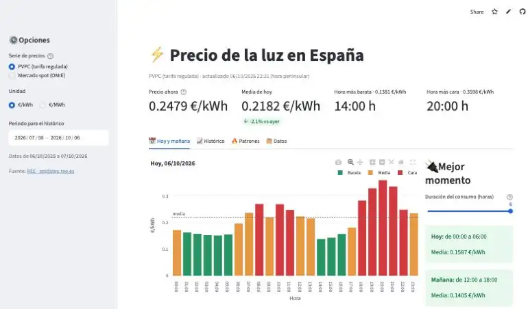

# ⚡ Spanish Electricity Price Dashboard

Interactive dashboard that tracks the hourly price of electricity in Spain — both the regulated consumer tariff (**PVPC**) and the wholesale **day-ahead spot market** — using open data from Red Eléctrica de España (REE).

An automated ETL pipeline downloads the prices every day, stores them in a SQL database and the Streamlit app turns them into actionable insights: *when is the cheapest time to run the washing machine today?*

**🔗 Live demo: [precio-luz-espana.streamlit.app](https://precio-luz-espana.streamlit.app)**



## Features

- **Live KPIs**: current price, today's average vs. yesterday, cheapest and most expensive hour.
- **Today & tomorrow**: hourly prices colour-coded as cheap / medium / expensive (tomorrow's prices appear after ~20:15 CET).
- **Best time to consume**: finds the cheapest window of *N* consecutive hours (e.g. 2 h for a washing machine, 3 h for EV charging).
- **History**: daily average with min–max band and 7-day moving average; PVPC vs. spot comparison.
- **Patterns**: weekday × hour heatmap, average hourly profile and monthly distribution.
- **Data export**: filterable table with CSV download.
- Switch between **€/kWh** and **€/MWh**.

## Architecture

```
REE REData API ──► src/etl.py ──► SQLite (data/prices.db) ──► app.py (Streamlit + Plotly)
   (JSON)          extract →             ▲
                   transform →           │
                   load (upsert)   GitHub Actions (daily cron)
```

| Layer | Details |
|---|---|
| **Extract** | `GET /es/datos/mercados/precios-mercados-tiempo-real` from [apidatos.ree.es](https://www.ree.es/es/apidatos). Requests are split into 7-day chunks with retries and exponential back-off. |
| **Transform** | JSON → pandas. Since Oct 2025 the spot market is published in 15-minute intervals, so it is aggregated to hourly averages to align it with PVPC. Timestamps are stored in UTC (primary key) and Europe/Madrid local time, which handles daylight-saving changes correctly. |
| **Load** | Idempotent `INSERT … ON CONFLICT DO UPDATE` into SQLite; every run is logged in an `etl_runs` table. |
| **Automation** | A GitHub Actions workflow runs the tests, updates the data every evening and commits the refreshed database. |
| **App** | Streamlit + Plotly, with cached data loading. |

### Data model

```sql
prices(ts_utc PK, series PK ['pvpc'|'spot'], ts_local, price_eur_mwh)
etl_runs(run_at_utc, start_date, end_date, rows_upserted)
VIEW daily_prices  -- daily avg / min / max per series
```

[`sql/analysis.sql`](sql/analysis.sql) contains example analytical queries (CTEs, window functions such as `LAG` and `ROW_NUMBER`, self-joins): month-over-month change, PVPC–spot spread, cheapest hour per day, weekday vs. weekend…

## Run it locally

```bash
git clone https://github.com/<your-user>/precio-luz-espana.git
cd precio-luz-espana
python -m venv .venv && source .venv/bin/activate
pip install -r requirements-dev.txt

python -m src.etl --backfill 365   # download one year of prices
streamlit run app.py               # open http://localhost:8501
```

Other ETL options:

```bash
python -m src.etl                                   # incremental update
python -m src.etl --start 2025-01-01 --end 2025-12-31
sqlite3 data/prices.db < sql/analysis.sql           # run the analysis queries
python -m pytest                                    # run the tests
```

## Deploy

1. Run the **Actualizar precios** workflow once from the *Actions* tab with `backfill_days = 365` to fill the database.
2. Deploy for free on [Streamlit Community Cloud](https://share.streamlit.io): *New app* → this repo → `app.py`.
   (If the database is empty the app downloads the last 90 days on start-up.)

## Project structure

```
├── app.py                     # Streamlit dashboard
├── src/
│   ├── etl.py                 # extract / transform / load
│   ├── db.py                  # SQLite access
│   └── analysis.py            # pure analysis functions (tested)
├── sql/
│   ├── schema.sql             # tables, indexes and views
│   └── analysis.sql           # analytical SQL queries
├── tests/                     # pytest + REE response fixture
├── data/prices.db             # database (updated by GitHub Actions)
└── .github/workflows/         # daily data update + CI tests
```

## Ideas for next steps

- Price forecasting for the next day (Prophet / XGBoost with weather data from AEMET).
- Add the energy generation mix (renewables share) and correlate it with prices.
- Migrate the storage layer to PostgreSQL.

## Data source & licence

Data: [Red Eléctrica de España – REData API](https://www.ree.es/es/apidatos). Code under the MIT licence.

---

Author: **Juan Pedro Ortega Mbomio** · [LinkedIn](https://www.linkedin.com/in/juan-pedro-ortega-mbomio-85224521b)
